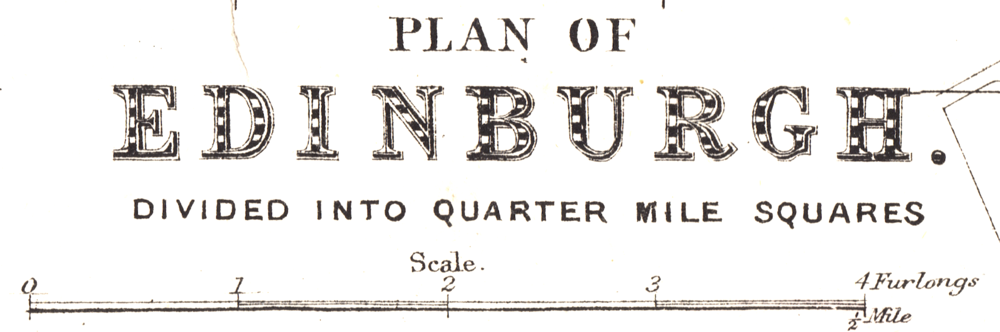
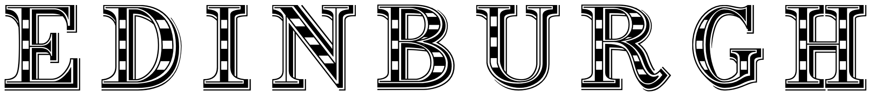

# map-fonts

This repository contains fonts that mimic the style found on a variety of maps. For now, this includes fonts that are found on maps by [G. W. Bacon].

Fonts are designed in [Sketch], exported as SVG, then imported to [BirdFont].

## GW Bacon Title (Regular)

## License

Fonts are licensed under the [SIL Open Font License (OFL) version 1.1-update5][OFL].

[G. W. Bacon]: https://en.wikipedia.org/wiki/George_Washington_Bacon
[Sketch]: https://www.sketch.com
[BirdFont]: https://birdfont.org
[OFL]: https://scripts.sil.org/cms/scripts/page.php?item_id=OFL-FAQ_web
[CC-BY-NC-SA 4.0]: http://creativecommons.org/licenses/by-nc-sa/4.0/
